# M1-JEE-Project - Interns Supervision Solution (I2S)

## Table of contents

- [Informations](#Informations)

- [Features](#Features)

- [Installation](#Installation)

- [Tests](#Tests)

- [Use of the website](#use_of_the_website)

## Informations

### Team Composition

Group composed of : 

- Mathieu Cantagrel
- Théo Delettre
- Vincent Dubois
- Vincent Mouillon
- Karsten Roy
- Victor Tang  ...

Group : SE2

### Description

JEE Web Application that help any teacher at EFREI Paris supervise easily the interns assigned to him/her.

### Technologies/framework used

Built with

- Java
- CSS
- Javascript
- JEE Plateform

IDE 

- IntelliJ IDEA  

Database

- PostgreSQL

Application server

- Glassfish 5

But also...

- Maven

- Docker

- SonarQube

- JUnit and Mockito

- JMeter

## Features

This project enables any teacher to supervise the internships of his student.
He can :

- login with his Efrei email address and his password
- see, on the homepage, all the internship assigned to him
- filter this internship by years, name of the student and keywords.
- update the information of the internship on the homepage
- see the details of the internship on the mission details page
- update the information of the internship on the mission details page
- logout

## Installation

### Versions

#### Version 1

Use the branch `version1`. You are able to run a deployed version using `docker-compose up -d` once the project is built using Maven. You don't need to setup the database or the server.

If you wish to use Glassfish, follow the instructions below.

#### Version 2

Use the branch `main`. Because of the differences between Glassfish and Wildfly as application servers, you cannot use the same setup. Please follow the instructions below.

### Database

#### Set up of PostgreSQL with Glassfish

For more information on how to use Glassfish and PostgreSQL, please read the following [documentation](https://github.com/nerstak/M1-JEE-Project/blob/main/doc/Use%20Postgress%20with%20Glassfish.md).

#### Set up of the database with PostgreSQL

For more information on how to set up our database, please read the following [documentation](https://github.com/nerstak/M1-JEE-Project/blob/main/doc/Setup%20database%20with%20PostgreSQL.md).

#### Connection to the database with Java

The login, password and url connection to the database are stored inside the [db.properties](https://github.com/nerstak/M1-JEE-Project/blob/main/src/main/webapp/WEB-INF/db.properties) file.   
Those strings are used in the DataServices classes, for the version 1.

For the version 2, credentials are stored inside the [persistence.xml](https://github.com/nerstak/M1-JEE-Project/blob/main/src/main/resources/META-INF/persistence.xml) file.

### Building

`mvn package`

## Tests

Note that tests are only available in the Version 2.

### Unit testing coverage

Unitary tests have been set up for most of our code base. The only part not tested are the models (EJB), because they are only beans with no complexity.

To run the tests, use `mvn clean package`. 

Every information related to these tests will be displayed in the terminal.

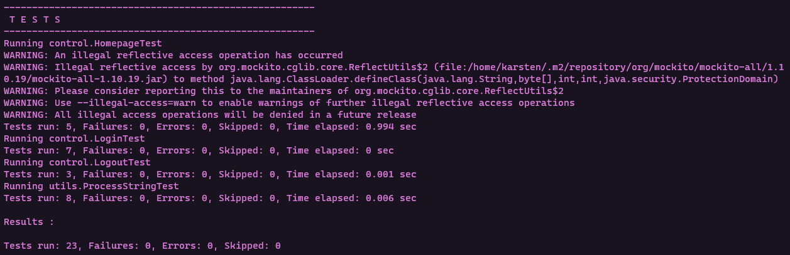

### Static testing

SonarQube has been set up to provide some static testing on the software. It provides informations on potential bugs, security risks and mistakes. Thanks to this tool, we have been able to reduce errors. To use it, please see this [documentation](https://github.com/nerstak/M1-JEE-Project/blob/main/doc/Setup%of%sonarqube.md).

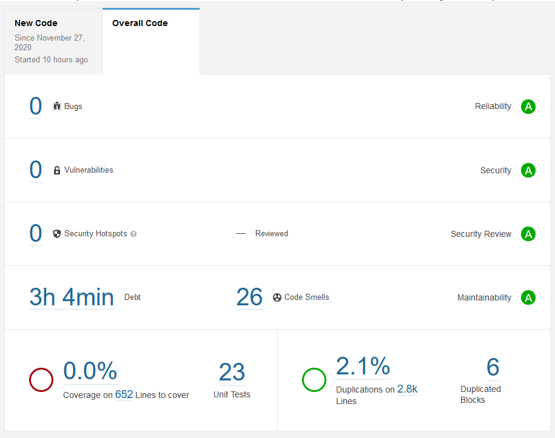

### JMeter testing

JMeter has been used to have some performance tests. However, while you have JMeter file located inside the `jmeter` folder that is working, you may not be able to use it: it has been built with different UUIDs for the data. Some screenshots have been placed inside the report.

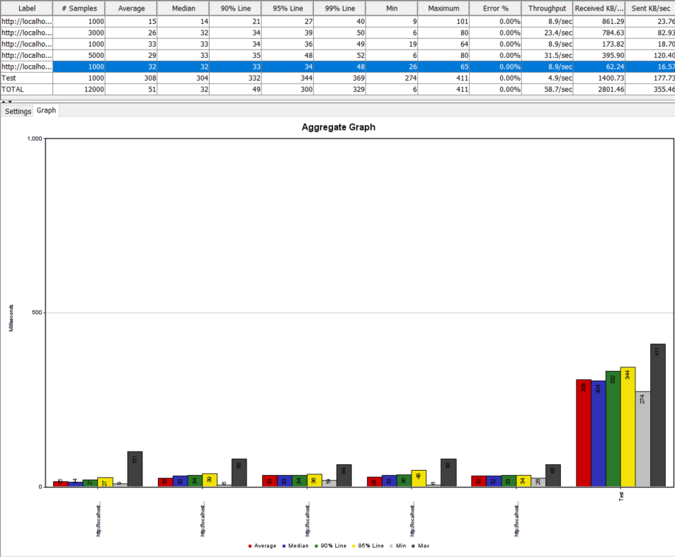

## Use of the website 

### Login

You first need to login in the login page :

If you make a mistake in your credentials or if you let field empty, an error message will be displayed.  
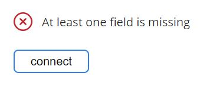  

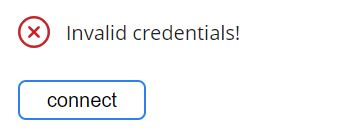

### Homepage

Once you are logged in, you have access to some actions on the home page.  
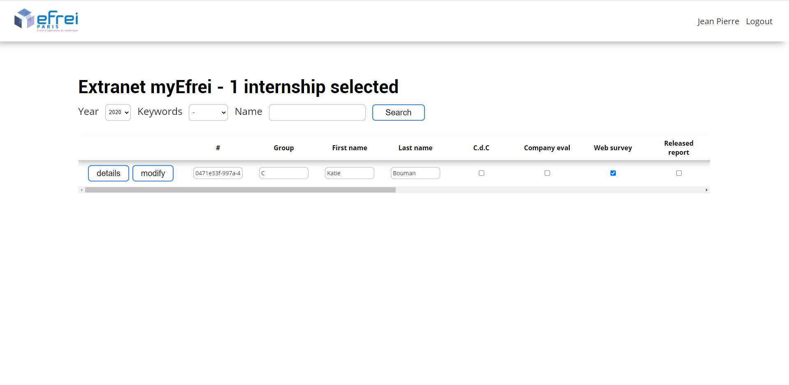
First, you have an overview of all the interns that are assigned to you in the table.  
You can modify every information and validate your change by clicking on the "modify" button at the beginning of the line.  
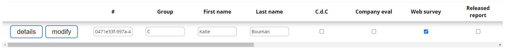
Also, you can see more details about an internship by clicking on the "details" button on each line. This will redirect you to the mission details page.  
You can filter the internships by the year, keywords or name of the intern and validate your choice by clicking on the "Search button".  
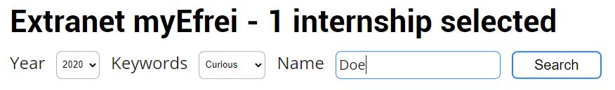  
Last, you can logout of your account by clicking on the logout button placed in the top right corner, just right next to your name. You will be redirect to the login page.  

### Details

On the mission details page, you will be able to modify other information.
Company :

- Name of the company

- Intern supervisor inside the company

- Begin date

- End date

- Address of the company   
  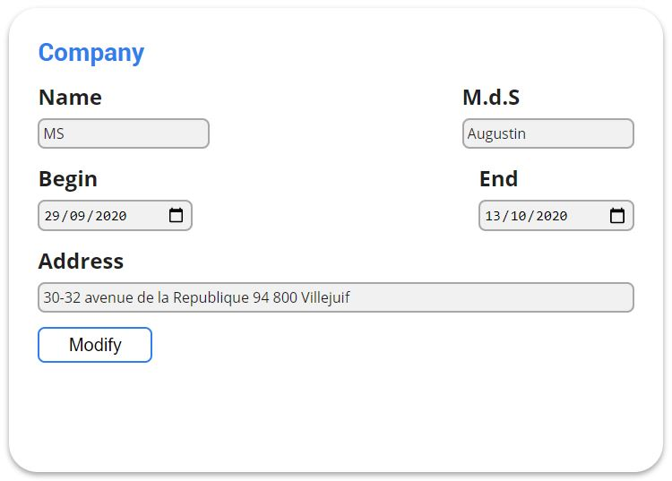 

Student :

- Group

- First name

- Last name

- Email

- URL of the linkedin profile   
  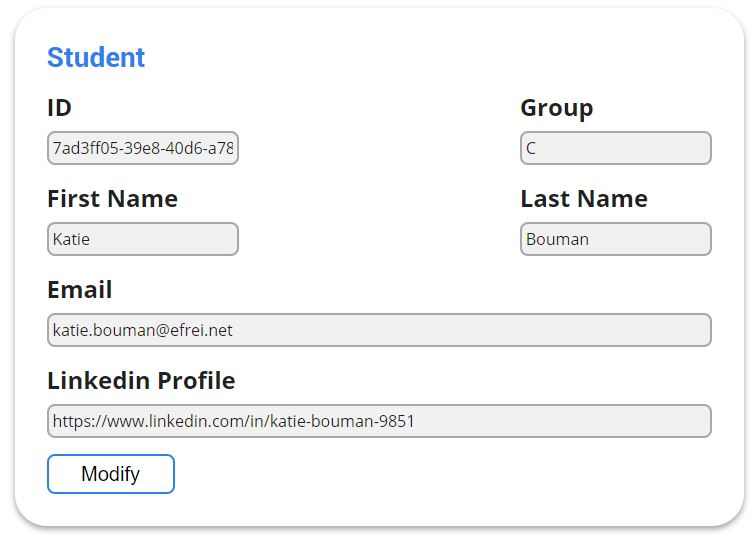   

Internship :

- Report's title

- Description

- Your comments

- The student comments  
  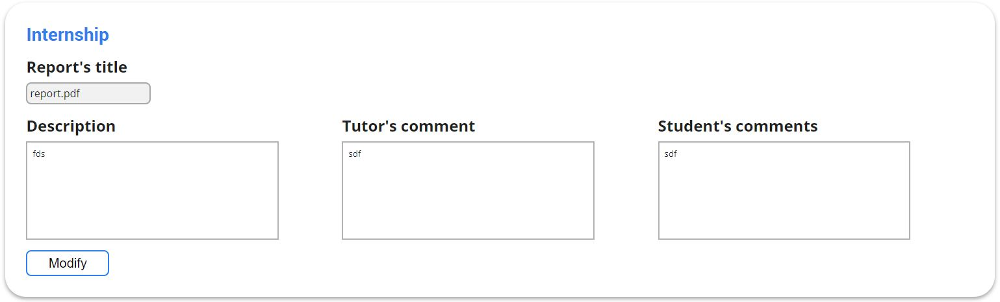   

Skills and keywords : 

- Add keywords

- Add skills  
  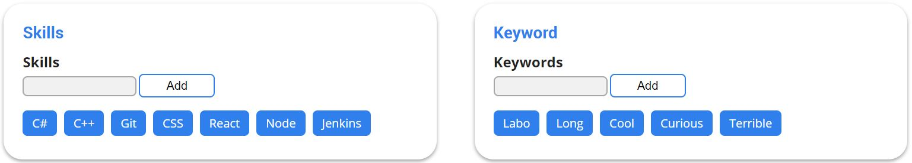   

You must click on the "modify" or "add" button of each section you have modified to validate your changes.
A message will be displayed each time you modify something to keep you inform about the changes. 

  

  
